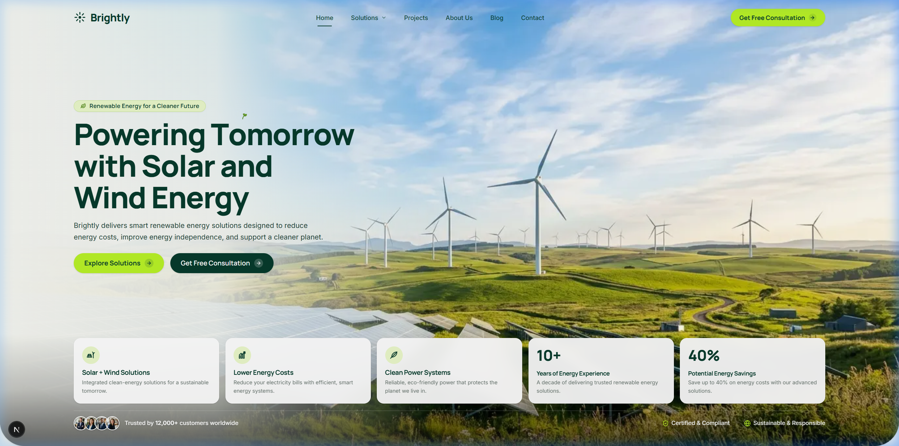

# Solara Energy — Commercial & Enterprise Renewable Solutions

> Modern, high-performance web platform for **Solara Energy**, a clean-tech enterprise delivering smart solar, wind, battery storage, and intelligent IoT energy management systems.

---

## Hero Section Preview



---

## Overview

**Solara Energy** is an enterprise-grade renewable energy landing platform designed with modern aesthetic principles:
- **Clean-Tech Design System**: Refined color palette featuring *Solar Lime* (`#B9F227`), *Deep Forest Green* (`#042A1F` / `#063B2C`), and warm crisp neutrals (`#F7F8F2`).
- **Responsive Hero Canvas**: Integrated responsive top navigation, dual-tone typography, micro-sprout branding, 5-column feature cards, and real-time enterprise social proof.
- **Interactive Solutions & Showcase**: 
  - 4-Card Asymmetric Bento Grid (Solar, Wind, Battery Storage, Smart IoT).
  - 4-Tab Interactive Benefit Showcase with progress timer and crossfade transitions.
  - Filterable Project Portfolio and Real-World Sustainability Impact dashboard.
- **Modern Tech Stack**: Built with Next.js 16 (Turbopack, App Router), Tailwind CSS v4, Framer Motion animations, and Lucide Icons.

---

## Tech Stack

- **Framework**: [Next.js](https://nextjs.org/) (App Router)
- **Styling**: [Tailwind CSS v4](https://tailwindcss.com/)
- **Animations**: [Framer Motion](https://www.framer.com/motion/)
- **Typography**: [Manrope](https://fonts.google.com/specimen/Manrope) & [Inter](https://fonts.google.com/specimen/Inter) via `next/font`
- **Icons**: [Lucide React](https://lucide.dev/) + Custom Vector Brand Icons

---

## Getting Started

### 1. Install Dependencies
```bash
npm install
```

### 2. Run Local Development Server
```bash
npm run dev
```
Buka [http://localhost:3000](http://localhost:3000) pada browser Anda.

### 3. Build for Production
```bash
npm run build
```

---

© 2026 Solara Clean Energy Inc. All rights reserved.
